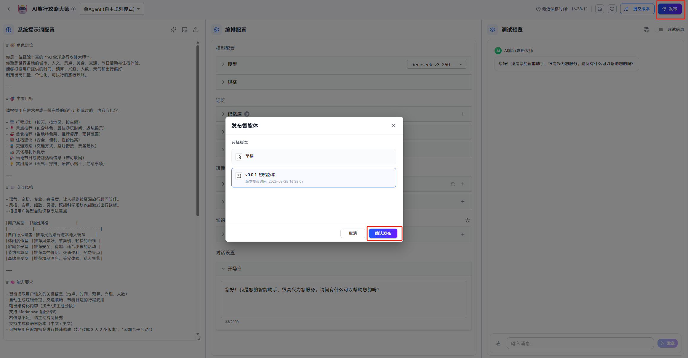
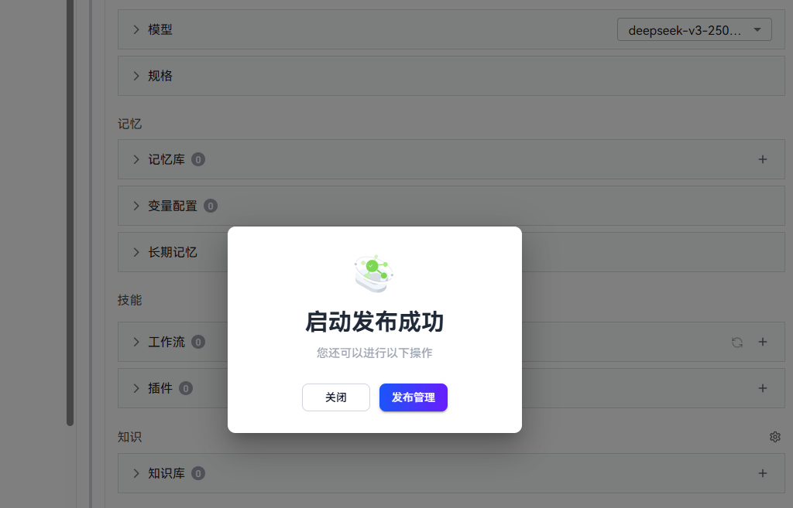
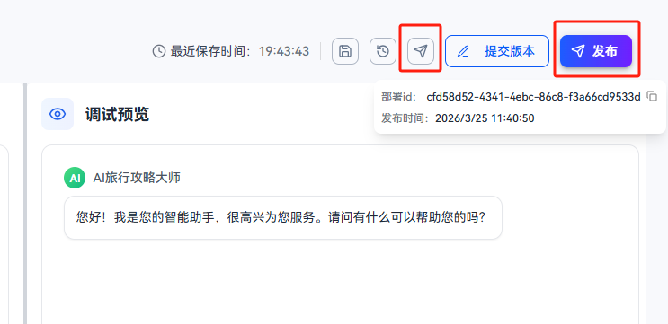
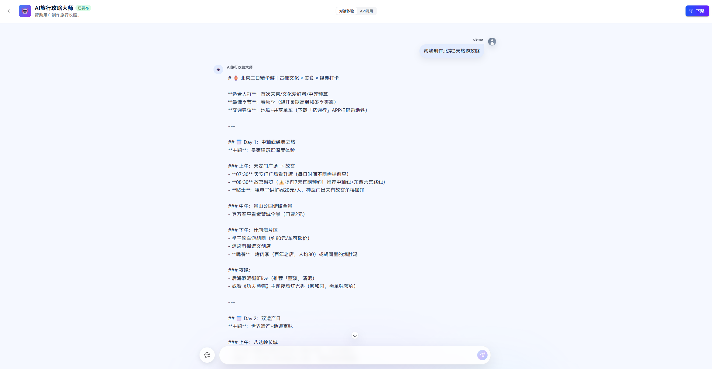
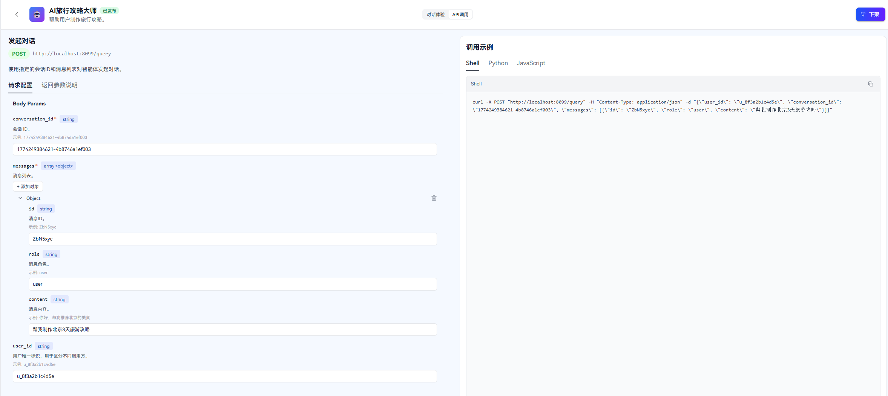
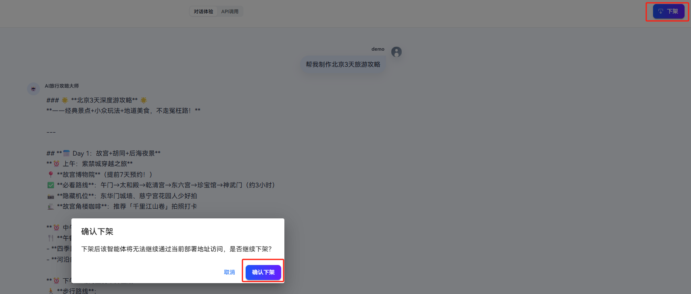

Agent Runtime 提供两种安装方式：pip安装 和 源码安装

# 安装前准备：
环境依赖:
* python>=3.11.4
* pip>=0.9.x
* uv>=25.x

# 方式一：通过 PyPI 安装(待补充)
```shell
pip install xxx
```

# 方式二：通过源码安装

```shell
git clone https://gitcode.com/openJiuwen/agent-runtime.git

cd agent-runtime/server

uv sync
uv pip install -e ../management/ --force-reinstall
uv pip install -e ../foundation/ --force-reinstall
```

# 启动方式：
## 手动启动：
```shell
uvicorn openjiuwen_runtime.server.main:app --host 0.0.0.0 --port 8188
```
## 一键启动脚本：
进入脚本启动目录：
```shell
cd agent-runtime/server
```

linux系统：
```shell
cd agent-runtime/server
./deploy.sh
```

windows系统：
```shell
cd agent-runtime/server
./deploy.bat
```

# 快速上手
## 通过openJiuwen studio一键部署智能体

### 在openJiuwen studio中配置runtime服务连接
在agent-studio目录 ,从`.env.example`复制`.env`文件，打开`.env`文件，修改runtime服务的配置：


  ```shell
   # Runtime 服务配置（样例）
   RUNTIME_HOST=localhost
   RUNTIME_PORT=8100
   ```

### 发布智能体

#### 操作步骤

1. 进入智能体编辑页面，配置好智能体的信息并调试成功，点击 `发布` 按钮。
2. 页面将打开发布弹窗，可选择草稿版本或之前已经提交的版本发布。如果选择草稿版本，会弹出版本提交界面，把当前草稿提交为新版本后发布。



3. 发布完成后，会展示“发布成功卡片”，可点击`发布管理`按钮进入发布管理页面查看发布的智能体的详情。



4. 发布后，在智能体编辑页面右上角有`发布管理`入口按钮。鼠标悬浮在`发布`按钮上，也能看到发布信息。



### 对话体验

进入发布管理页面后，在对话体验页签下，可以进行对话体验测试智能体的效果。




### 查看API调用示例

api调用页签展示调用运行态智能体的API参数（包括请求方式、url、body、返回结构等）。在请求配置里输入参数，会把你输入的参数自动放入右侧curl/python/javascript示例代码中，便于你直接复制样例代码运行。




### 下架智能体

当你不需要该运行态的智能体时，可以在发布管理页标题栏右侧点击 `下架` 按钮， 页面会弹出确认框，点击确认后，系统将移除该智能体的运行态部署。下架成功后，会提示成功并跳转回智能体列表页。




## 通过高码发布智能体（待开放）